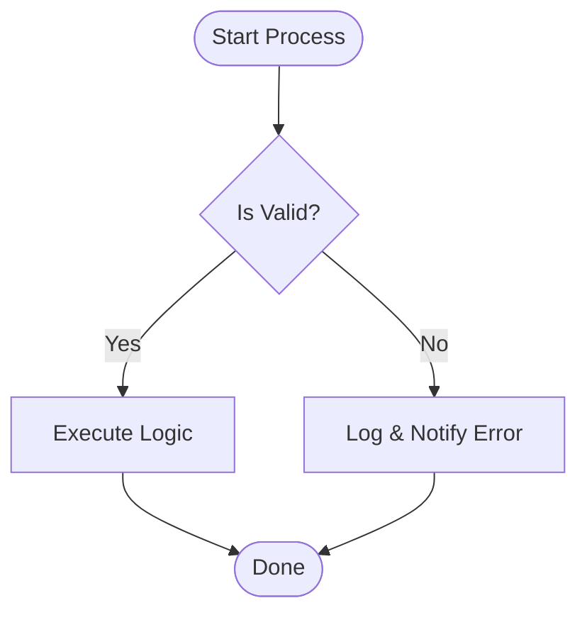
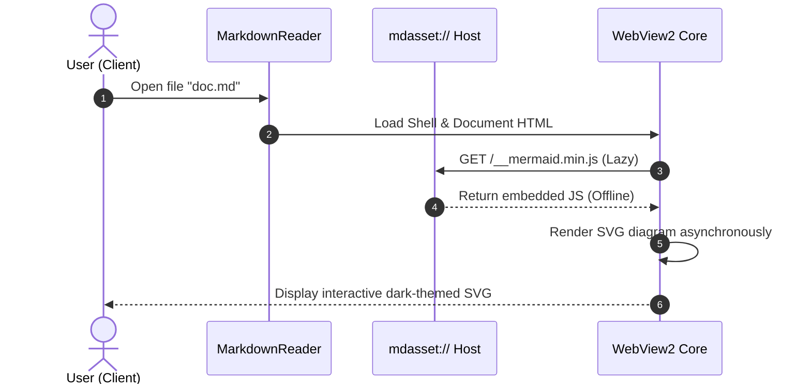
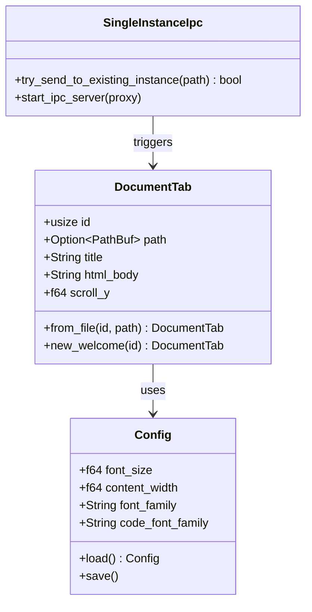
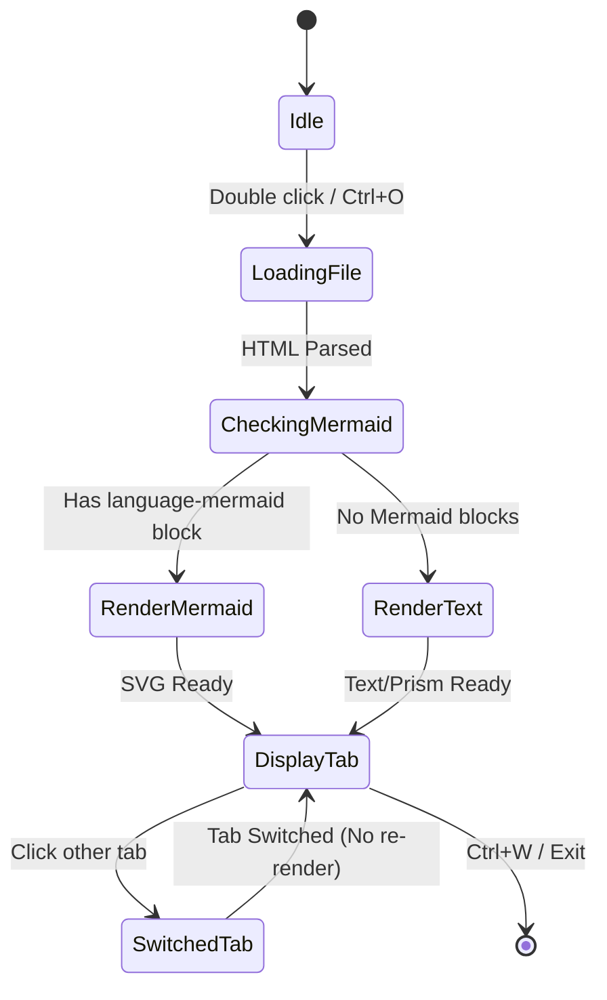
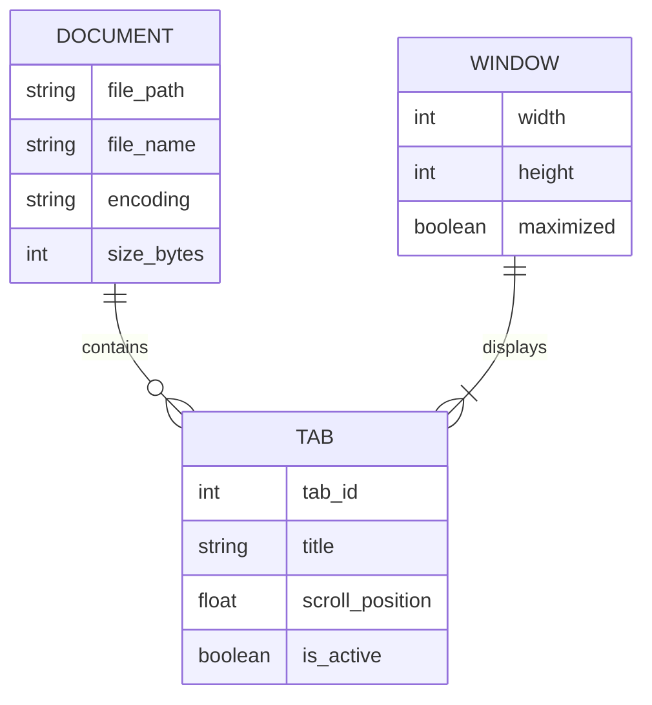
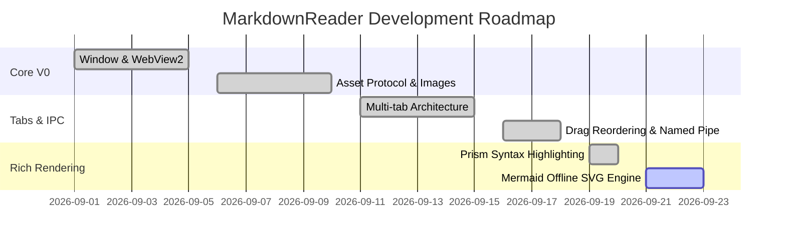
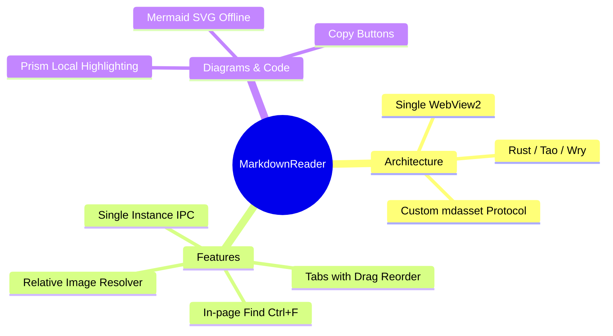
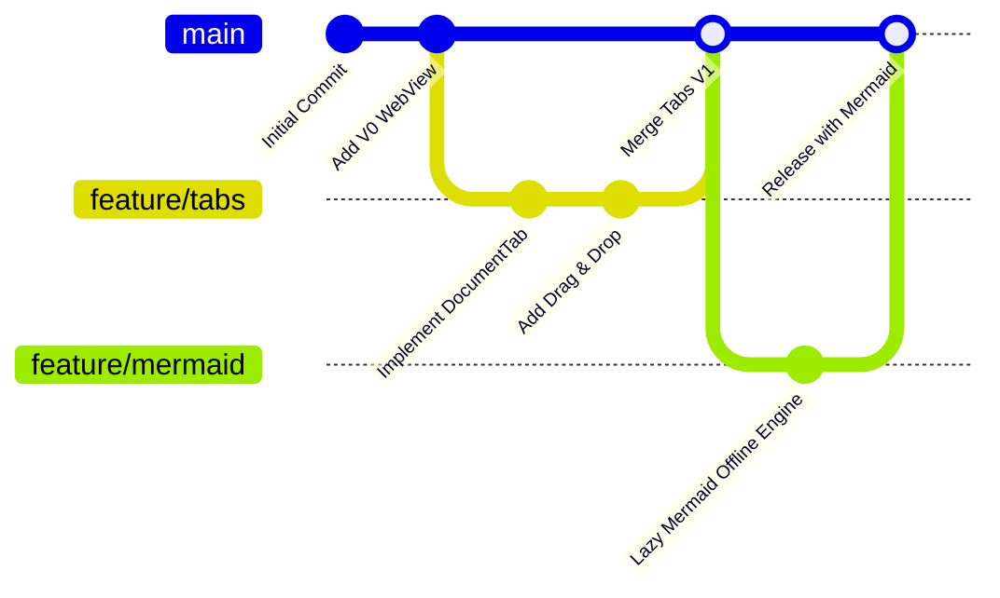
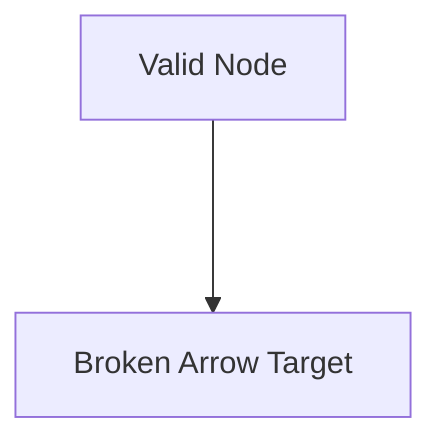

# Test Mermaid Diagrams & Multi-language Code

This test document tests offline Mermaid rendering across all required diagram types, error handling, and co-existence with Prism code highlighting.

---

## 1. Flowchart


---

## 2. Sequence Diagram


---

## 3. Class Diagram


---

## 4. State Diagram


---

## 5. ER Diagram


---

## 6. Gantt Chart


---

## 7. Mindmap


---

## 8. Git Graph


---

## 9. Error Handling Test (Invalid Mermaid Syntax)

The block below has intentional invalid syntax (`--->` error). It should render a discrete error box with the error message and a copyable block containing the raw source code.



---

## 10. Standard Code Blocks (Prism Test)

```rust
// Verify Rust code highlighting works alongside Mermaid
pub fn fibonacci(n: u64) -> u64 {
    match n {
        0 => 0,
        1 => 1,
        _ => fibonacci(n - 1) + fibonacci(n - 2),
    }
}
```

```python
# Verify Python code highlighting
def calculate_metrics(data: list[float]) -> dict:
    return {
        "mean": sum(data) / len(data),
        "count": len(data)
    }
```
